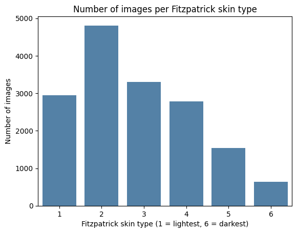

# Skin tone bias in dermatology AI

*Personal project by Aurélie Biaou, MSc Biotechnology and AI (Sup'Biotech × EPITA)*

## Introduction

Measuring the bias of a dermatology AI tool based on skin color.

This project brings together two things I care about: the cosmetic industry, and the world of AI innovation that is part of our present and our future.

The goal is to train a model on images of different skin colors and see if a dermatology AI is reliable on every skin color or not. And if it is not, where does this gap come from, and how can we reduce it?

Color and adaptation to the client are among the most important parts of the cosmetic industry. Obviously you want to reach as many people as you can, and it is important to be inclusive and to respect diversity. But AI models are not always right. A tool that is supposed to analyze the skin can learn too much from one type of skin and then make mistakes on the others.

If we look further into innovation, these kinds of tools could one day help detect early skin cancers, or skin diseases in general. For that, the model has to be reliable and adapt to every skin type.

This project follows several courses from my first year of MSc:

- **Medical imaging**, where we analyzed DICOM and medical images with Python to manage and modify them depending on the needs.
- **Python and data mining**, which helped me build and understand code and manage a whole machine learning process, from preparing the data to training and testing a model.

## Expected results

1. Build a model that can classify skin images, from a non-invasive lesion to a highly malignant one.
2. Evaluate the performance of the model for each skin color.
3. If there are gaps, find out whether they come from the skin color itself or from a lack of data on dark skin.
4. Try to reduce this gap.

## Datasets

**Fitzpatrick17k** is the reference dataset for studying skin color bias in dermatology. It contains 16,577 clinical images from two online dermatology atlases (DermaAmin and Atlas Dermatologico). Each image is labeled with a skin condition and a Fitzpatrick skin type, from 1 (lightest) to 6 (darkest).

Later in the project, I plan to use **SCIN** (Google) to test the model on a wider range of skin tones.

The images are not stored in this repository. The notebook loads the metadata from the [official Fitzpatrick17k repository](https://github.com/mattgroh/fitzpatrick17k), which is under the CC BY-NC-SA 3.0 license.

## Notebook 1: Data exploration

The Fitzpatrick17k dataset is strongly imbalanced. Light to medium skin tones (types 1 to 4) represent most of the images, while dark skin tones (types 5 and 6) represent only around 14% of the images with a known skin type. Type 6, the darkest, has only about 635 images. The 565 images with an unknown skin type were removed.



This imbalance is doubled by the distribution of diseases. Malignant lesions represent 9.6% of dark skin images, against 12.4% for medium skin and 15.4% for light skin. As a result, a model trained on this data will see about 6 times fewer malignant examples on dark skin than on light skin.

| Skin group | Benign | Malignant | Non-neoplastic |
|---|---|---|---|
| Light (1-2) | 14.4% | 15.4% | 70.2% |
| Medium (3-4) | 13.8% | 12.4% | 73.7% |
| Dark (5-6) | 9.4% | 9.6% | 81.0% |

**Why it matters:** a model that mostly learns from light skin and non-neoplastic conditions may tend to miss cancers (false negatives), especially on dark skin. This is the hypothesis I will test in the bias analysis.

**Limitation:** these proportions only describe the dataset, which is built from images selected by two dermatology atlases. They do not reflect how frequent skin cancer is in the population.

### Is this a known problem?

Yes. Previous studies have shown that dermatology AI models perform worse on darker skin, largely because training datasets under-represent them (Daneshjou et al., 2021).

A good example is **ModelDerm**, a skin lesion classification algorithm developed in South Korea and available online. On its original data, it reached a ROC-AUC of about 0.93, which suggests it separates malignant from benign lesions very well. In 2022, Roxana Daneshjou's team at Stanford tested it on a new dataset, the Diverse Dermatology Images (DDI). It contains biopsy-confirmed cases and represents dark skin much better. In these conditions, the ROC-AUC of ModelDerm dropped to about 0.65, and it was even lower on skin types V and VI (Daneshjou et al., 2022).

This shows that a good score proves nothing as long as we don't know which data it was obtained on. When training images poorly represent some skin colors, the model reproduces this imbalance when it makes a diagnosis. This is exactly what I want to measure in this project.

### What about generative AI?

If the datasets we found are limited in dark skin tones, could images made by generative AI be biased too?

An exercise in my ethics class made me check whether an AI would be biased depending on what I asked it. When I asked for a picture of a cute child, most of the time the child was white. When I asked the AI why, the answers were strange, and in the end it just admitted it was biased, when it could easily have generated a child with dark skin.

And research confirms it: they are biased. If we ask an AI to generate a photo of a poor person or of a low-paid job, it will most likely show a person with dark skin. For well-paid jobs such as doctor or lawyer, it will most likely show a white person. These models are trained on stereotypes and on images found on the internet. The best-known open source model, Stable Diffusion, was trained on the LAION-5B dataset. The biases detected are not only racial, but also gender biases, with some jobs only associated with men or with women.

Tools such as the [Stable Bias Explorer](https://huggingface.co/stable-bias) from Hugging Face measure the gap between the gender and ethnicity markers in generated images and real diversity.

One idea to balance the data in this project would be to generate images of dark skin with generative AI, to fill the lack of dark skin images. But wouldn't it be wrong to use biased algorithms to fix another biased algorithm? This could be a limit of the project, and I will think about it in Notebook 2, where I will try to balance the data.

## Next steps

- **Notebook 2:** balancing the data
- **Notebook 3:** training the model and measuring its performance for each skin group
- **Notebook 4:** testing on SCIN

## Project structure

```
skin-tone-bias-dermatology/
├── README.md
├── requirements.txt
├── notebooks/
│   └── 01_data_exploration.ipynb
└── images/
    └── skin_type_distribution.png
```

## How to run it

Open the notebook in Google Colab and run the cells in order. The metadata is downloaded directly from the official Fitzpatrick17k repository, so there is nothing to upload.

## References

- Daneshjou R. et al. *Lack of Transparency and Potential Bias in Artificial Intelligence Data Sets and Algorithms: A Scoping Review*. JAMA Dermatology, 2021.
- Daneshjou R. et al. *Disparities in dermatology AI performance on a diverse, curated clinical image set*. Science Advances, 2022.
- Groh M. et al. *Evaluating Deep Neural Networks Trained on Clinical Images in Dermatology with the Fitzpatrick 17k Dataset*. CVPR Workshops, 2021.
- Diallo K. *Cet outil permet de voir les biais dans les IA génératrices d'images*. L'Éclaireur Fnac, 4 November 2022.
- Hugging Face, Stable Bias: https://huggingface.co/stable-bias
